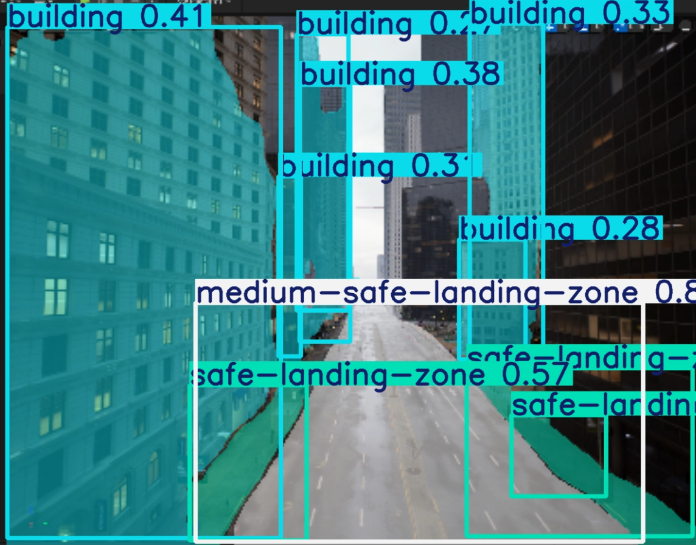
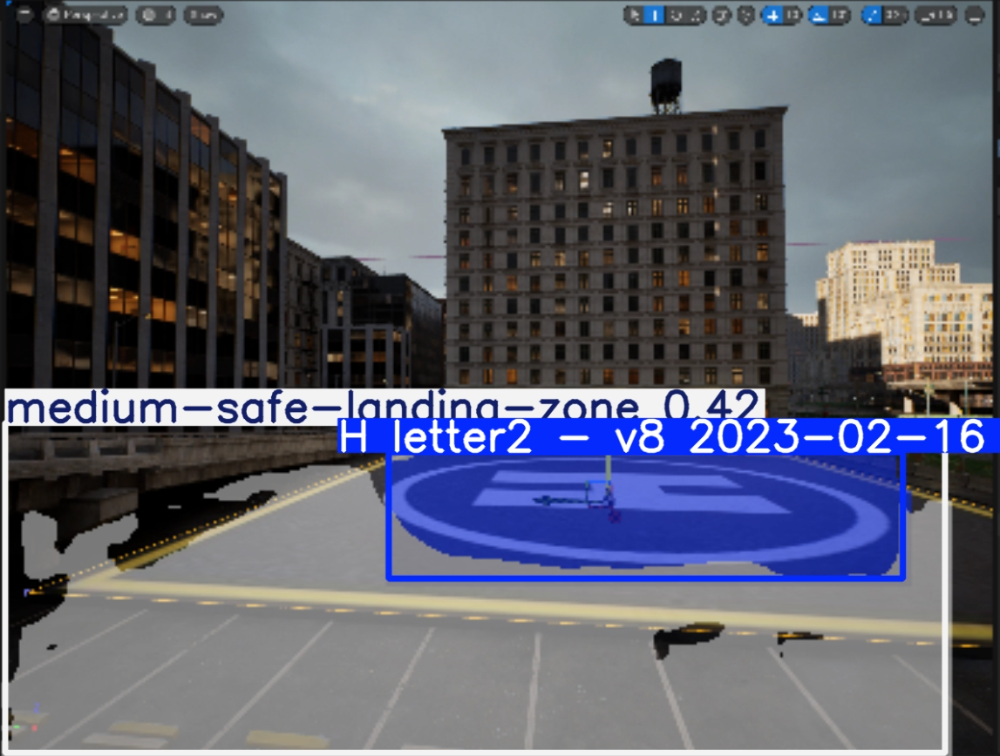

## Как работает алгоритм посадки ?
### алгритм посадки разбит на 2 этапа 
### Этап 1: Определение места призмеления (Готово)
1. С помощью предобученной модели - определяется безопасная зона для посадки. (На данный момент существует 3 опции зоны посадки safe, medium, helipad)
2. 
3. 
### Этап 2: Автоматическое направление дрона в посадочную зону (В работе)
1. После успещного определения зоны посадки, на вычислительном устройстве дрона (Orange pi) будет просчитываться траектория посадки, и дрон будет направляться в размеченную посадочную область

## Инструкция по развертке проекта автономной посадки дронов в симуляторе


# Глава 1: установка Unreal Engine и плагина Airsim

==Если у вас возникли проблемы со следованием этому разделу, можете посмотреть этот [гайд](https://www.youtube.com/watch?v=BVkN3CCMg4A "ссылка")== 

### Шаг 1: Установка Unreal Engine 5
1. Перейти по **[ссылке](https://store.epicgames.com/ru/ "ссылка")** на официальный сайт компании Epic Games. Зарегистрировать аккаунт, скачать и установить **Epic games launcher**

2. В самом лунчере перейти на вкладку **Unreal Engine => Библиотека** и установить Unreal Engine версии **5.4.4**


### Шаг 2: Установка Visual Studio 2022 с пакетами для сборки плагина
1.  Перейти по **[ссылке](https://visualstudio.microsoft.com/ru/vs/ "ссылка")** на страницу загрузки **Visual Studio**. скачать **Visual Studio Community edition**

2. В окне Visual Studio Installer выбрать для дополнительной установки пункты **Разработка классических приложений на C++** (В разделе 'Сведения об установке' выберите sdk подходящий для вашей версии операционной системы windows 10/11) и **Разработка ир на C++**, также во вкладке **Отдельные компоненты** выберите опцию 'Пакет SDK для .NET'

3. Подтвердить установку всех выбранных компонентов
### Шаг 3: Установка плагина Airsim
1. *Опциональный шаг*: Если у вас не установлен **Git** - установите его по этому **[гайду](https://git-scm.com/book/ru/v2/%D0%92%D0%B2%D0%B5%D0%B4%D0%B5%D0%BD%D0%B8%D0%B5-%D0%A3%D1%81%D1%82%D0%B0%D0%BD%D0%BE%D0%B2%D0%BA%D0%B0-Git "ссылка")**, если он у вас есть - переходите к следующему шагу 
2. Создайте папку в удобном вам месте (Желательно чтобы на пути папки не было символов на кирилице) 
3. Откройте ранее установленную **Visual Studio** и откройте командную строку разработчика 

4. Коммандой `git clone https://github.com/CodexLabsLLC/Colosseum.git`склонировать репозиторий на свою машину
5. Перейти в директорию Colosseum командой `cd Colosseum`
6. Запустить сборку командой `build.cmd`

### Шаг 4: Инициалзиация проекта Unreal Engine
1. Запустите установленный ранее **Unreal Engine** и создайте новый проект. 
2. Во вкладке инструменты (Tools) выберите пункт **Создать новый класс C++** (Create new C++ class)

3. Следуйте указаниям диалогового окна:


4. После данных манипуляций в папке вашего проекта будет создан .sln файл (стандартное место расположения проектов Unreal Engine: **Документы => Unreal Projects**)

### Шаг 5: Финальная сборка Unreal + Airsim
1. Из папки где мы собирали Airsim (Шаг 3) копируем папку **Plugins** находящуюся по адресу **Unreal => Plugins** и вставляем ее в коревую директорию папки с проектом Unreal (Шаг 4)

2. Откройте файл под именем **<Название вашего проекта>.uproject** в любом текстовом редакторе и замените внутрее содерживое на следующий код: 
```
{
    "FileVersion": 3,
    "EngineAssociation": "5.4",
    "Category": "Samples",
    "Description": "",
    "Modules": [
        {
            "Name": "<НАЗВАНИЕ ВАШЕГО ПРОЕКТА>",
            "Type": "Runtime",
            "LoadingPhase": "Default",
            "AdditionalDependencies": [
                "AirSim"
            ]
        }
    ],
    "TargetPlatforms": [
        "MacNoEditor",
        "WindowsNoEditor"
    ],
    "Plugins": [
        {
            "Name": "AirSim",
            "Enabled": true
        }
    ]
}
```
3. Перейдите в папку **Config** и откройте в текстовом редакторе файл **DefaultGame.ini**. 

К находящимуся внутри коду добавьте следующую строчку `+MapsToCook=(FilePath="/Colosseum/ColosseumAssets")`
4. Вернитесь в корневую директорию проекта. Правой кнопкой мыши нажмите на файл **<Название вашего проекта>.uproject** и выберите пункт **Generate Visual Studio project files**

5. Запустите файл **<Название вашего проекта>.sln** с помощью **Visual Studio 2022** 

В Visual Studio откройте **Обозреватель решений** найдите файл который имеет название **вашего проекта** кликните правой кнопокой мыши и выберите пункт **Собрать**

### Шаг 6: Настройка файла json и проверка работоспособности
1. Перейдите в директорию куда вы установили **Unreal Engine** (Шаг 1) перейдите по этому пути **UE_5.4\Engine\Binaries\Win64** и создайте там файл c названием **settings.json**

С помощью текстового редактора добавьте в файл **settings.json** следующий код:
```
{
  "SettingsVersion": 1.2,
  "SimMode": "Multirotor",
  "ClockType": "SteppableClock",
  "Vehicles": {
      "PX4": {
          "VehicleType": "PX4Multirotor",
          "UseSerial": false,
          "LockStep": true,
          "UseTcp": true,
          "TcpPort": 4560,
          "ControlIp": "remote",
          "ControlPortLocal": 14540,
          "ControlPortRemote": 14580,
          "LocalHostIp": "IP ВАШЕГО WSL",
          "Sensors":{
              "Barometer":{
                  "SensorType": 1,
                  "Enabled": true,
                  "PressureFactorSigma": 0.0001825
              }
          },
          "Parameters": {
              "NAV_RCL_ACT": 0,
              "NAV_DLL_ACT": 0,
              "COM_OBL_ACT": 1,
              "LPE_LAT": 47.641468,
              "LPE_LON": -122.140165
          }
      }
  }
}
```
2. Откройте **Unreal Engine** и запустите ранее созданный вами проект

В открывшемся окне во вкладки Окно (Window) выберите стандартную раскладку **Unreal Engine**:

3. Откройте **Outliner** в Unreal Engine и проверьте есть ли у вас объект **PlayerStart**.

Если такого объекта на вашей карте нет - то создайте его с помощью меню **Place Actors**

4. Далее нам надо **изменить стандартный игровой режим**.
Для этого во вкладке Окно (Window) выберем пункт **World Settings**. 

В открывшемся окне выбираем **Selected GameMode** как **AirSimGameMode**

5. **Запускаем симуляцию нажатием на зеленый треугольник:**


Симулятор запущен и готов принимать внешние соединения !


# Глава 2: установка SITL PX4 в WSL 

==Если у вас возникли проблемы со следованием этому разделу, можете посмотреть этот [гайд](https://www.youtube.com/watch?v=DiqgsWIOoW4&t=443s "ссылка")== 

### Шаг 1: Установка WSL и PX4
1. Перейти в **Microsoft store** и ввести в строку поиска **wsl** установить первый результат поисковой выдачи

2. В терминале windows с помощью команды **ipconfig** узнать ip адресс wsl

3. Открыть командную строку и прописать команду `wsl`

4. Склонировать репозиторий в wsl коммандой `git clone https://github.com/PX4/PX4-Autopilot.git --recursive`

5. С помощью команды `nano ~/.bashrc` добавить системную переменную **PX4_SIM_HOST_ADDR** комаандой `export PX4_SIM_HOST_ADDR=` присвоить значение найденное на шаге 2
6. Перейти в дерикторию **/PX4-Autopilot** и использовать команду  `make px4_sitl_default none_iris`


# Глава 3: Python код для автономного управления дроном в WSL 

==Если у вас возникли проблемы со следованием этому разделу, можете посмотреть этот [гайд](https://www.youtube.com/watch?v=yivyNCtVVDk "ссылка")== 

### Шаг 1: Установка Python
1. Посмотреть [гайд](https://www.youtube.com/watch?v=hK-fZhh4v8I "ссылка") по установке Python в wsl
### Шаг 2: Развертка кода автономного управления
1. Скопировать репозиторий в wsl командой `git clone https://github.com/ildimas/Aerohack_Beverly_Hills_Misis_4.git`
2. Cоздать виртуальное окружение с помощью команды `python3 -m venv envi` (!Вы можете выбрать другое название)
3. Активировать виртуальное окжуение командой `source envi/bin/activate`

4. Запустить энтрипоинт файл mavsdk_test.py командой `python3 mavsdk_test.py`

**Порядок запуска симуляции: Unreal Engine => SITL PX4 => Python код**